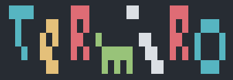

Termiro helps you to add colorful titles and graphics to your CLI apps.

While working on a few personal projects like [battle_ship](https://github.com/jo-quin/battle_ship) where I added graphics and messages to enhance the user experience, I found a convenient way to create and display 8-bit looking images.

Now I have extracted this code into a Ruby Gem which makes it easy to use in future apps and easy to share with the community.
Termiro is an [open source](#license) project, therefore, everyone is welcome to use it and [contribute](#contributing).

## Installation

Add this line to your application's Gemfile:

```ruby
gem 'termiro'
```

And then execute:

    $ bundle

Or install it yourself as:

    $ gem install termiro

## Usage

Once Termiro is [installed](#installation) in your project create a folder called 'graphics' on your main working directory.

```
mkdir graphics
```

Termiro will look on this folder to find your drawings.

Then create a text file inside the graphics folder and start to draw!

```
touch graphics/my_drawing.txt
```

To print the drawing from your app you need to first require Termiro.

```
require 'termiro'
```

Then use Termiro's draw method passing the name of your drawing as an argument.

```
Termiro.draw('my_drawing')
``` 

## How to draw using Termiro

Drawing in Termiro is like filling little squares with whenever color you choose.

Every square is really a whitespace and Termiro simply changes the background color of these whitespace.

In your text file you write 'r' for red and Termiro will change the character 'r' for a whitespace with a red background.

The color codes are the following:

- r -> red

- y -> yellow

- b -> blue

- g -> green

- m -> magenta

- c -> cyan

- w -> white

- x -> black

For an empty space Termiro uses the '-' (minus) character.

As an example follow the steps on [Usage](#usage) section to create an empty .txt file in your project and copy paste the following text:

```
-------------
----rrrr-----
---rrwwrr----
---yxyyxy-ww-
---yyxxyy-rr-
-rrbbrrbbrr--
-rrbybbyb----
-wwbbbbbb----
---bb--bb----
--rrr--rrr---
-------------
```

Say hi to Mario! :)


## Contributing

Bug reports and pull requests are welcome on GitHub at https://github.com/jo-quin/termiro. This project is intended to be a safe, welcoming space for collaboration, and contributors are expected to adhere to the [Contributor Covenant](http://contributor-covenant.org) code of conduct.

## License

The gem is available as open source under the terms of the [MIT License](https://opensource.org/licenses/MIT).

## Code of Conduct

Everyone interacting in the Termiro project’s codebases, issue trackers, chat rooms and mailing lists is expected to follow the [code of conduct](https://github.com/jo-quin/termiro/blob/master/CODE_OF_CONDUCT.md).
